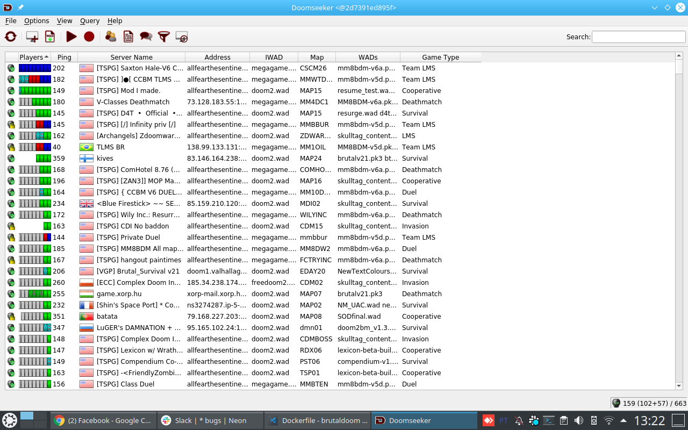
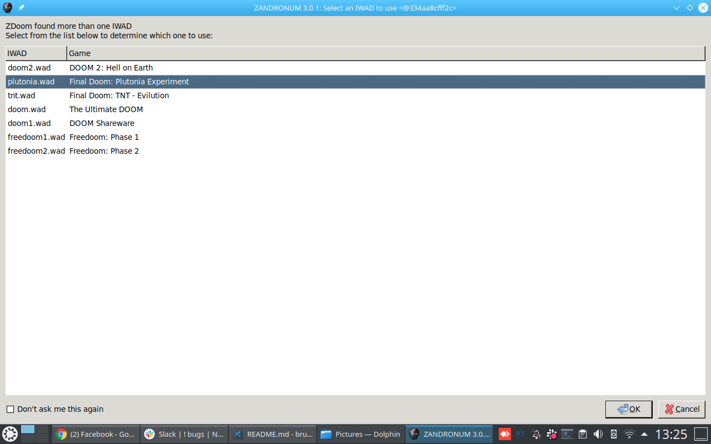
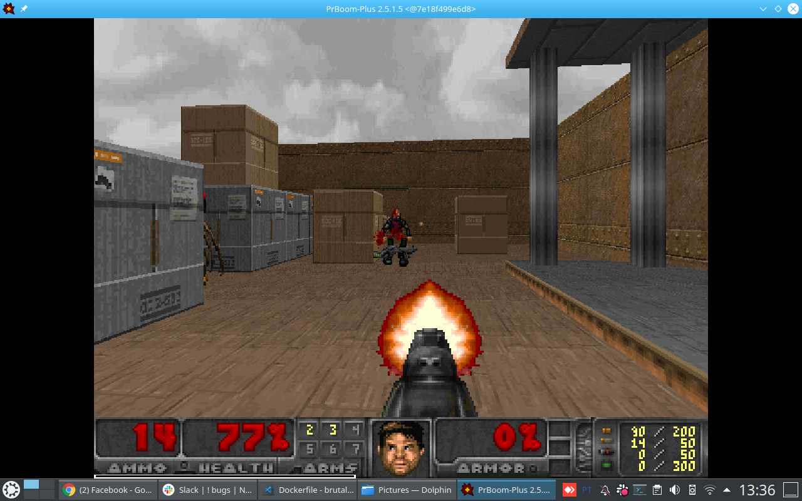
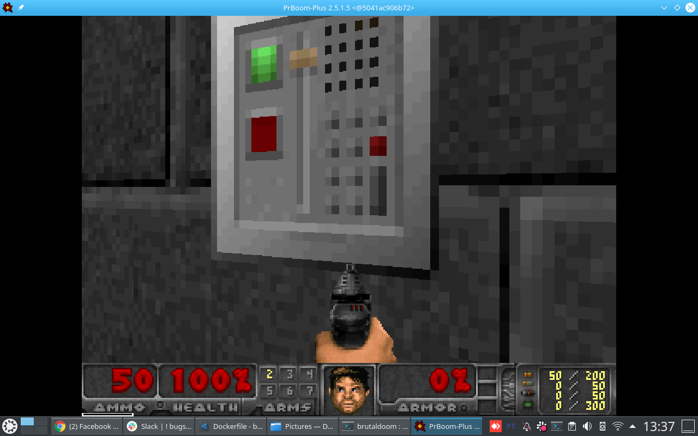
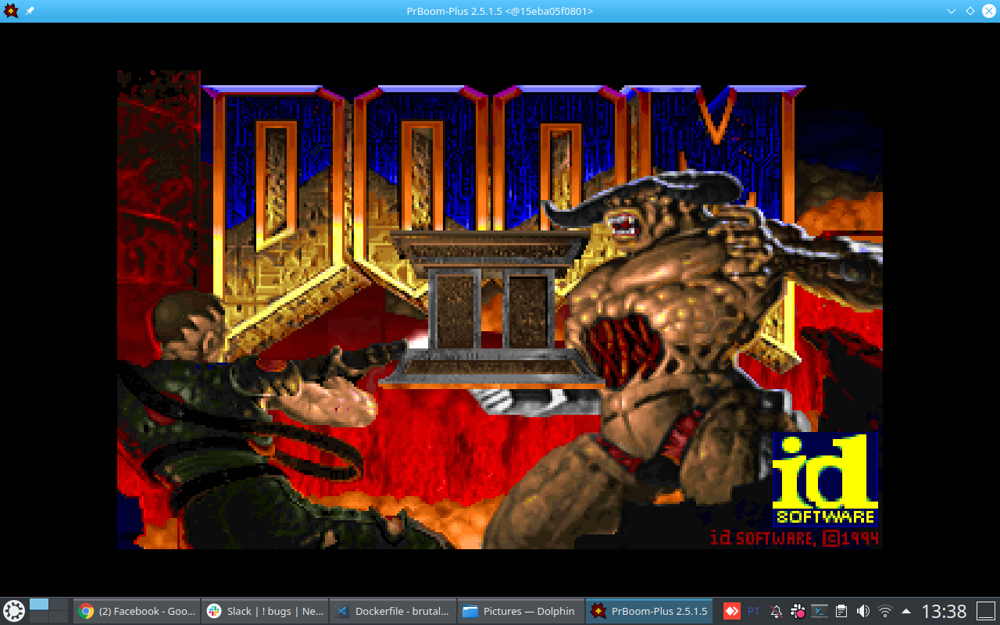
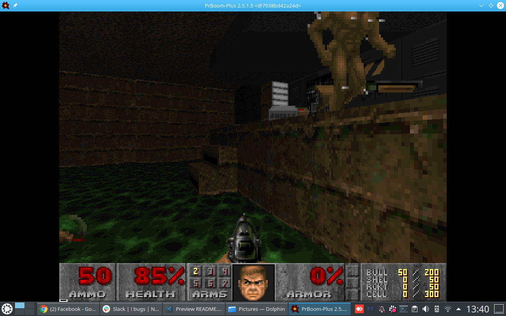

# Brutal Doom v21 - Docker

The docker projetc to brutal doom.

This project make a Brutal Doom docker image.

This docker version run need a  X server to run.

I have proble with sound. But coming soon! Maybe! 


## articles
I make this image using this articles from [Xerxes Lins](mailto:xerxeslins@gmail.com)

* [JOGUE DOOM CLÁSSICO COMPLETO NO LINUX COM PRBOOM](https://www.vivaolinux.com.br/artigos/impressora.php?codigo=15116) 
* [BRUTAL DOOM NO LINUX MINT (UBUNTU)](https://www.vivaolinux.com.br/artigos/impressora.php?codigo=15129) 

## brutal doom files
* [Brutal Doom v21](https://www.moddb.com/mods/brutal-doom/downloads/brutal-doom-v21-beta)
* [Doom Metal v5](https://www.moddb.com/mods/brutal-doom/downloads/doom-metal-soundtrack-mod-volume-5)
  This is a large file to [github](https://github.com) download file and copy the file [DoomMetalVol5.wad](https://www.moddb.com/mods/brutal-doom/downloads/doom-metal-soundtrack-mod-volume-5) into dir `usr/games/zandronum/skins`.

## docker

### building

```bash
$ docker build --pull --rm -f Dockerfile -t pedrorobsonleao/brutaldoom:latest .
```

### running

#### doomseeker
```bash
$ docker run \
        --rm \
        -e DISPLAY=$DISPLAY \
        -v /tmp/.X11-unix:/tmp/.X11-unix \
        --device /dev/snd  \
        pedrorobsonleao/brutaldoom
```


#### zandronum
```bash
$ docker run \
        --rm \
        -e DISPLAY=$DISPLAY \
        -v /tmp/.X11-unix:/tmp/.X11-unix \
        --device /dev/snd  \
        pedrorobsonleao/brutaldoom zandronum
```


### freedoom

#### freedoom1
```bash
$ docker run \
        --rm \
        -e DISPLAY=$DISPLAY \
        -v /tmp/.X11-unix:/tmp/.X11-unix \
        --device /dev/snd  \
        pedrorobsonleao/brutaldoom freedoom1
```



#### freedoom2
```bash
$ docker run \
        --rm \
        -e DISPLAY=$DISPLAY \
        -v /tmp/.X11-unix:/tmp/.X11-unix \
        --device /dev/snd  \
        pedrorobsonleao/brutaldoom freedoom2
```


### prboom-plus

```bash
$ docker run \
        --rm \
        -e DISPLAY=$DISPLAY \
        -v /tmp/.X11-unix:/tmp/.X11-unix \
        --device /dev/snd  \
        pedrorobsonleao/brutaldoom prboom-plus 
```

---
```bash
$ docker run \
        --rm \
        -e DISPLAY=$DISPLAY \
        -v /tmp/.X11-unix:/tmp/.X11-unix \
        --device /dev/snd  \
        pedrorobsonleao/brutaldoom prboom-plus -iwad doom2.wad -file tnt.wad
```

---
```bash
$ docker run \
        --rm \
        -e DISPLAY=$DISPLAY \
        -v /tmp/.X11-unix:/tmp/.X11-unix \
        --device /dev/snd  \
        pedrorobsonleao/brutaldoom prboom-plus -iwad doom2.wad -file plutonia.wad
```
---

